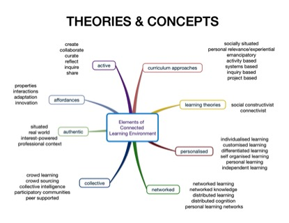


<h2>Connected Learning</h2>

Connected learning is a pedagogical approach that connects people, networks and information. Connected learning empowers students to develop personal learning networks by interacting with real world, authentic learning environments (<a href="http://www.educause.edu/library/resources/7-things-you-should-know-about-connected-learning">Educause 2013</a>). It is production-centred and interest-driven, where students create, curate and share the results of their learning to a wider audience (Ito et al 2013).

Connected learning environments are influenced by a blend of contemporary student-centred learning theories, pedagogies and curriculum approaches that leverage the affordances of social media. The mind map below provides an overview of these theories and concepts. 

 

Connected learning is based on social learning including social constructivist, connectivist and network learning theories. Social constructivism holds that people make meaning and construct knowledge via interaction and dialogue with others (Perkins, 1999), while connectivism holds that knowledge is generated by, and resides in the network, and via connections in the network (<a href="http://halfanhour.blogspot.com.au/2014/04/connectivism-as-learning-theory.html">Downes, 2014</a>; <a href="http://www.elearnspace.org/Articles/connectivism.htm">Siemens, 2004</a>; <a href="http://elearnspace.org/Articles/networks.htm">Siemens 2005</a>). Likewise, network learning involves the theories of distributed learning and distributed cognition where “ information and communications technology (ICT) is used to promote connections: between one learner and other learners; between learners and tutors; between a learning community and its learning resources. (Goodyear, Banks, Hodgson, & McConnell, 2004, p. 1). These networks enable crowd learning (<a href="http://www.aupress.ca/books/120235/ebook/99Z_Dron_Anderson-Teaching_Crowds.pdf">Dron & Anderson, 2014</a>) and participation in online interest-based learning communities. 

Curriculum approaches that are associated with a connected learning environment are these that are student-centred, authentic and experiential. They exploit Web 2.0 technologies to allow students to be active creators and disseminators of knowledge and information. These approaches might involve emulating professional learning communities and basing curricula on the interests, experience and aspirations of students. 

Connected learning is also personalised, as it allows students to be self-directed in developing their own learning pathways and individualised learning environments (<a href="https://teachinginthewild.wordpress.com/2015/02/23/education-is-something-that-we-create-for-ourselves-personalized-learning-and-connected-learning/">Lupton, 2015</a>). For instance, students can develop Personal Learning Networks (Richardson & Mancabelli, 2011) where they connect with experts, mentors, peers and professional communities. They create a Personal Learning Environment (<a href=" http://eprints.qut.edu.au/54006/1/MAB_G.Caldwell_M.Bilandzic_M.Foth.pdf">Caldwell, Bilandzic, & Foth, 2012</a>) by mixing and matching a suite of tools to suit their purposes. They can follow their own interests and collate evidence of their learning in a Personal Learning Record that belongs to them, rather than belonging to an institution.

<ul>
	<li>
		Caldwell, G., Bilandzic, M., Foth, M. (2012). <a href=" http://eprints.qut.edu.au/54006/1/MAB_G.Caldwell_M.Bilandzic_M.Foth.pdf">Towards visualising people’s ecology of hybrid personal learning environments</a>. Paper presented at the Proceedings of the Media Architecture Biennale 2012, Association for Computing Machinery (ACM), Aarhus, Denmark.
	</li>
	<li>
		Downes, S. (2014). <a href="http://halfanhour.blogspot.com.au/2014/04/connectivism-as-learning-theory.html">Connectivism as Learning Theory</a>.  
	</li>
	<li>
		Dron, J., Anderson, T. (2014). <a href="http://www.aupress.ca/books/120235/ebook/99Z_Dron_Anderson-Teaching_Crowds.pdf">Teaching crowds</a>. Learning and social media. Edmonton: AU Press.
	</li>
	<li>
		EDUCAUSE. (2013). <a href="http://www.educause.edu/library/resources/7-things-you-should-know-about-connected-learning">7 things you should know about connected learning</a>.
	</li>
	<li>
		Goodyear, P., Banks, S., Hodgson, V., & McConnell, D. (Eds.). (2004). Advances in Research on Networked Learning. Dordrecht: Kluwer. 
	</li>
	<li>
		Ito, M., Gutierrez, K., Livingstone, S., Penuel, B., Rhodes, J., Salen, K., . . . Watkins, S. C. (2014). <a href="http://dmlhub.net/publications/connected-learning-agenda-for-research-and-design/">Connected learning: an agenda for research and design</a>
	</li>
	<li>
		Lupton, M (2015) <a href="https://teachinginthewild.wordpress.com/2015/02/23/education-is-something-that-we-create-for-ourselves-personalized-learning-and-connected-learning/">'Education is something that we create for ourselves': Personalized learning and connected learning</a>.
	</li>
	<li>
		Perkins, D. (1999). The many faces of constructivism. Educational Leadership, 57(3), 6-11. 
	</li>
	<li> 
		Richardson, W., & Mancabelli, R. (2011). Personal learning networks, Using the power of connections to transform education. Moorabbin, Vic: Hawker Brownlow Education.
	</li>
	<li>
		Siemens, G. (2004). <a href="http://www.elearnspace.org/Articles/connectivism.htm">Connectivism: A Learning Theory for the Digital Age</a>.
	</li>
	<li>
		Siemens, G. (2005). <a href="http://elearnspace.org/Articles/networks.htm">Connectivism: Learning as Network-Creation</a>.
	</li>
</ul>
 

